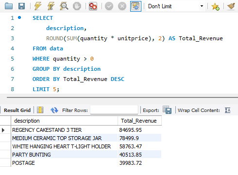
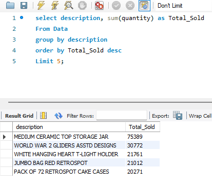
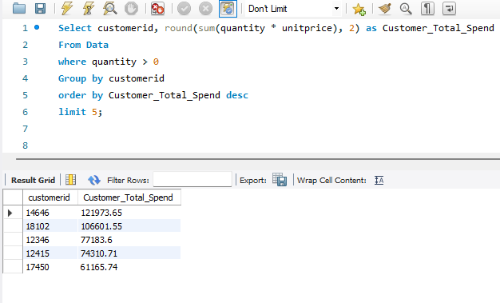
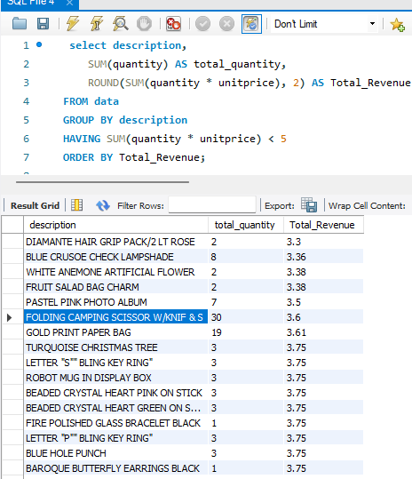
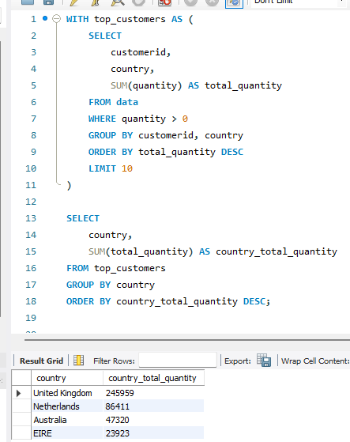
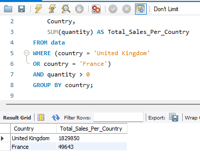

# E-commerce Analysis Dashboard

## Project Overview
This project analyses E-commerce customer behaviour, product performance, and sales trends using SQL and Power BI.

The analysis focuses on:
- Best-selling products
- Revenue performance
- Customer purchasing behaviour
- Country-level sales trends
- High-value customer analysis

The goal of this project was to practice real-world business analysis using transactional sales data while developing SQL querying, analytical thinking, and dashboard reporting skills.

---

## Dataset Information

The dataset contains transactional E-commerce sales data with the following fields:

| Column | Description |
|---|---|
| InvoiceNo | Invoice number |
| StockCode | Product stock code |
| Description | Product description |
| Quantity | Quantity purchased |
| UnitPrice | Price per unit |
| CustomerID | Customer identifier |
| Country | Customer country |

---

## Business Questions

1. What are the best-selling products by quantity sold?
2. Which products generate the highest and lowest revenue?
3. How do product sales differ between England and France?
4. Who are the top 5 customers by total spend?
5. Among the top 10 customers, which country purchased the highest quantity of items?

---

## SQL Skills Demonstrated

- Aggregate Functions (`SUM`, `ROUND`)
- Filtering with `WHERE`
- Grouping with `GROUP BY`
- Ranking using `ORDER BY`
- Limiting results with `LIMIT`
- Common Table Expressions (`WITH`)
- Business metric calculations
- Customer and country segmentation

---

## Key Insights

- Homeware and decorative products generated consistently strong sales performance across the dataset.
- The United Kingdom significantly outperformed France in total product sales volume.
- A small number of high-value customers generated a substantial proportion of total revenue.
- Some low-revenue products still achieved relatively high sales quantities due to low unit pricing.
- Distinct purchasing trends appeared across different countries and product categories.

---

## SQL Analysis Screenshots

### Top Revenue Products

Revenue analysis shows that **REGENCY CAKESTAND 3 TIER** **(£84,695.95)** generated the highest total revenue, followed by **MEDIUM CERAMIC TOP STORAGE JAR** **(£78,499.90)**. Both products significantly outperformed the remaining top-selling items within the dataset.

Interestingly, four of the top five revenue-generating products were either home décor or party-related items, suggesting strong customer demand within these categories.

Additionally, postage appeared among the highest revenue contributors, indicating that shipping fees represent a meaningful proportion of overall transaction revenue.

---

### Top Selling Products by Quantity

Quantity analysis identified **MEDIUM CERAMIC TOP STORAGE JAR** as the highest-selling product, with a total of **75,389** units sold. The product significantly outperformed all other items within the dataset, achieving more than double the sales volume of the second highest-selling product.

Additionally, multiple cake-case related products appeared among the top-selling items by quantity. This may indicate consistently strong consumer demand within this category and could suggest repeat purchasing behaviour associated with baking or party-related products.

---

### Top Customers by Total Spend

Analysis of customer spending identified customer **14646** as the highest-value customer, generating total revenue of **£121,973.65**, followed by customer **18102** with **£106,601.55** in total spend.
Both customers generated substantially higher revenue than the remaining top customers, suggesting a notable concentration of sales among a relatively small group of high-value buyers.

The remaining top five customers were:
   • Customer **12346** **(£77,183.60)** 
   • Customer **12415** **(£74,310.71)** 
   • Customer **17450** **(£61,165.74)** 
	
A notable trend among these customers was the frequent purchase of homeware-related products. This may indicate particularly strong demand for decorative and household items among the retailer’s highest-spending customer segment.

---

### Lowest Revenue Products

Revenue analysis of lower-performing products revealed a broad range of items generating similarly low levels of revenue. In total, **122** products were identified with total revenue of **£5** or less.

Among these lower-revenue products, **FOLDING CAMPING SCISSOR W/KNIF & S** recorded the highest sales volume, with a total quantity sold of **30** units. This suggests that although the product experiences relatively strong sales activity, its low unit price limits its overall revenue contribution.

---

### Country Sales Analysis

Analysis of the top 10 customers by purchase quantity revealed that the United Kingdom accounted for the highest combined purchase volume, with **245,959** units purchased across multiple high-value customers. This significantly exceeded the totals of all other countries represented within the top customer group.
The remaining countries represented among the top 10 customers were:
	• Netherlands – **86,411** units 
	• Australia – **47,320** units 
	• EIRE – **23,923** units 
Interestingly, although the United Kingdom generated the highest overall purchase volume, the Netherlands contained the single highest-volume customer, with one customer accounting for **86,411** purchased units alone. This may indicate the presence of a large-scale commercial buyer or bulk purchasing activity within the Dutch customer segment.

---

### England vs France Product Analysis

Analysis of total product sales by country shows that the United Kingdom significantly outperformed France, recording total sales volume of **1,829,850** units compared to **49,643** units respectively. This suggests substantially higher customer demand and transaction activity within the United Kingdom market.

Within the United Kingdom, **MEDIUM CERAMIC TOP STORAGE JAR** was the highest-selling product, with total sales of **75,101** units. Additionally, multiple RetroSpot and assorted-colour themed products appeared among the top-selling items, potentially indicating strong customer preference for decorative and themed household products.

In France, **MINI PAINT SET VINTAGE** recorded the highest sales volume. Several Red Spotty themed products also appeared among the top-selling items, suggesting consistent customer demand for this particular design style within the French market.

---

## Tools Used

- SQL
- Power BI
- GitHub

---

## Power BI Dashboard

Power BI dashboard screenshots and visual analysis will be added upon completion of the dashboard build.

---

## Author

Created as part of a personal Data Analytics portfolio project focused on developing practical SQL and business intelligence skills.
